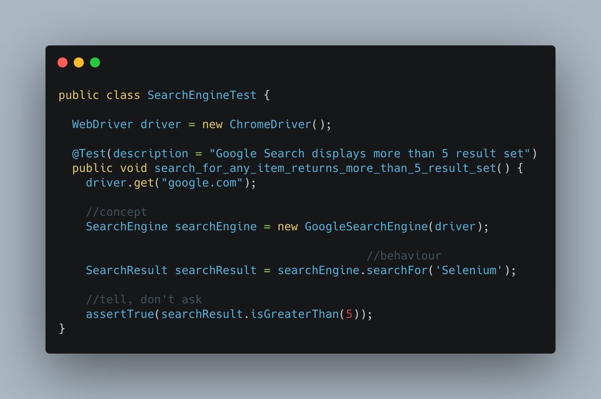
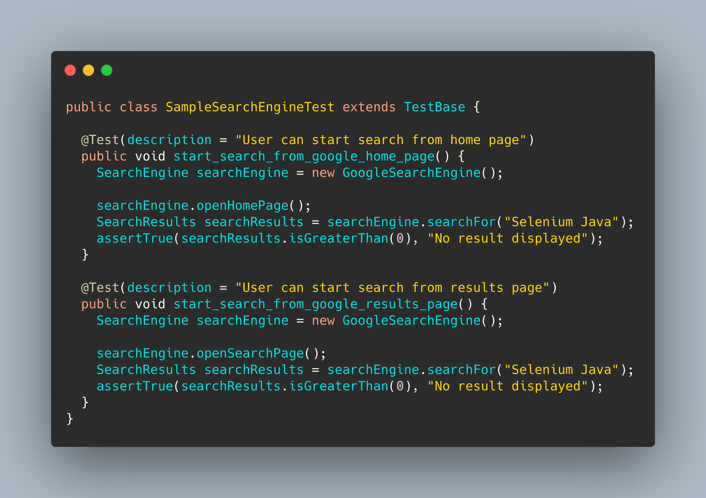
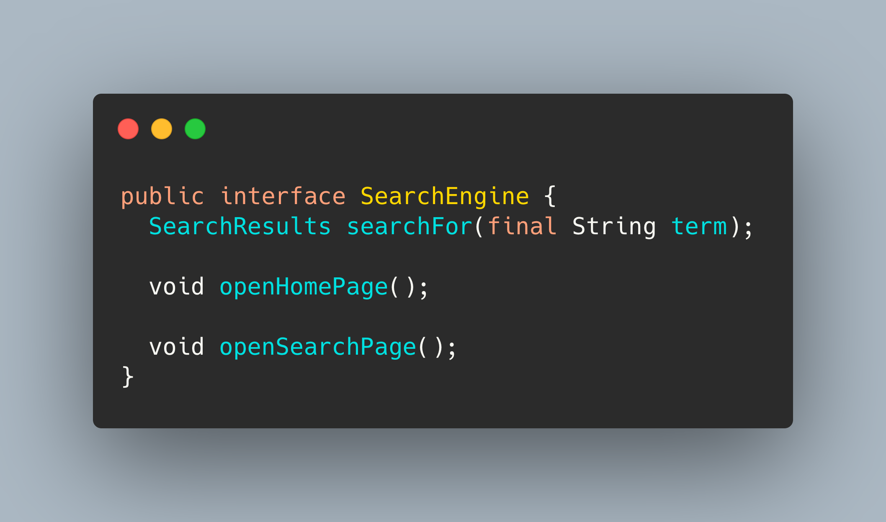
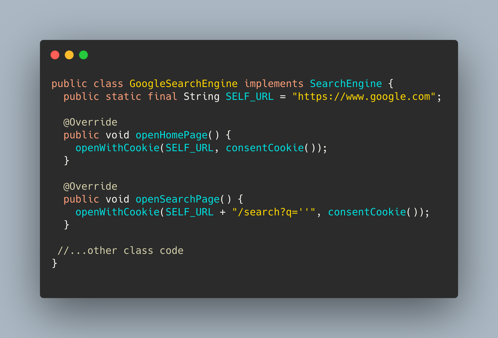
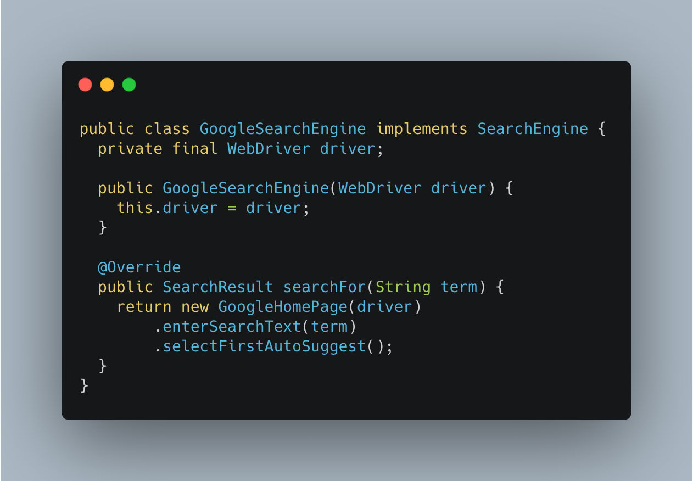
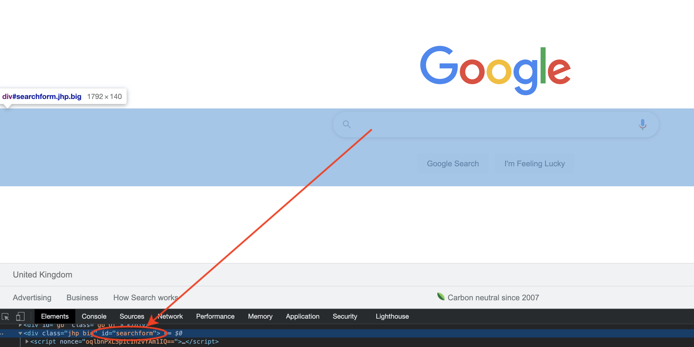
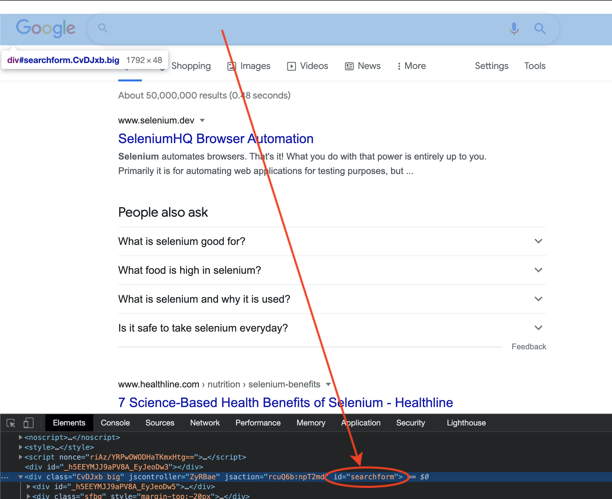
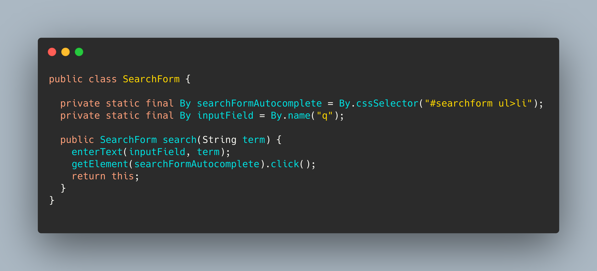
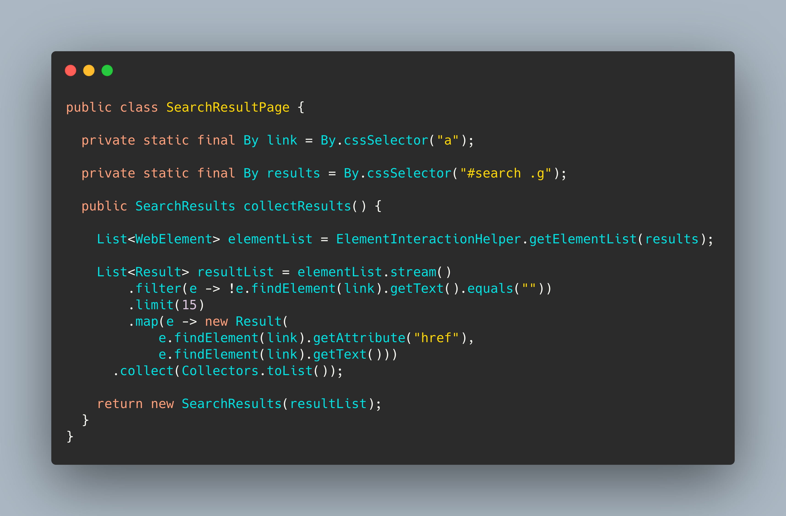
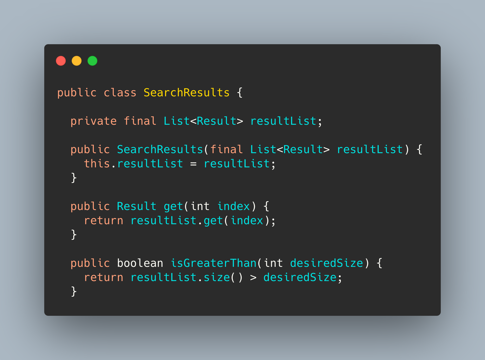

# A Beginner's Guide to Designing Page Objects - Pt.3

## Introduction
In the last post, we applied design techniques to refactor the test class and the underlying code design.

<!--more-->


Read it [here](/posts/a-beginners-guide-to-designing-page-objects-pt.2)


In this final guide, we will look at how to refactor a page object in response to changes from the business.

When you finish reading, you will be able to create effective page objects for any UI interface you encounter using design principles.

## Prerequisites

Before you begin this guide you'll need the following:


- Read [Part Two](/posts/a-beginners-guide-to-designing-page-objects-pt.2)


Let's do it 💪💪💪

## The Current Test:

### New Requirement:

- Add test to search from the results page.

There are two Test cases now.

We should write them out again so it is clear

#### Testcase 1: User can start search from Home page
1. Be on the `Home page`
1. Type `Selenium Java` in the searchbox
1. click the first suggestion from auto-suggest dropdown
1. Assert results are displayed on the search page.

#### Testcase 2: User can start search from results page
1. Be on the `Search results page`
1. Type `Selenium Java` in the searchbox
1. click the first suggestion from auto-suggest dropdown
1. Assert results are displayed on the search page.

_Notice how similar this journey is to our existing test case.
The only difference is one starts from the home page, the other from results page_

## Step 1 — Add the new test case

### What has changed?
- We added two new methods _`openHomePage()`_ & _`openSearchPage()`_ to the search engine object, to make sure the test starts from the right page.

- We changed the _test name_, _assertion_ and the _message returned_ on failure.

- We removed all references to WebDriver from the test class.

- **NOTHING ELSE!** That's right. Nothing else needed to change in the test class, because we have written a resilient class.
😉

## Step 2 — Let's update the interface with the 2 new methods

## Step 3 - Let’s implement the new methods.

## Step 4 - Let’s refactor the searchFor method in the GoogleSearchEngine Class.
Looking at current implementation below:

We notice the method began from the `GoogleHomePage`, entered `SearchText` via the HomePage and `results` is also coming from the homepage.

In a nutshell, the implementation of `searchFor()` couples it to the GoogleHomePage making it hard to cater for the new requirement.

What do we do?

##### Decouple SearchFor implementation from GoogleHomePage
- Find the common element between Homepage & Result page

- Go to homepage and search for #searchForm

- Go to Results page and search for #searchForm

You will notice the `searchForm` is common across all Google Pages. Thus, making it a candidate to extract from the Homepage and move to its own class with the search behaviours.

#### Let's create a SearchForm Class

#### Refactor searchFor() to use the searchForm in the GoogleSearchEngine class.

")

#### Add a Search Results page to extract results into Domain class SearchResults.
This page will extract the link & linkText values from the WebElement List and populates the SearchResults domain object.

### Now are back to the where we started.
The test class!

But this time, we have refactored all the framework code and the test should work perfectly.

## What have we done so far?
- Refactored the test class add new test case and remove framework code like `WebDriver`.

- Refactored `GoogleSearchEngine#searchFor` method to not depend on `GoogleHomePage`

- Added Navigation methods to the `SearchEngine` Interface.

- Created `SearchForm` component to handle all search related task.

- Created `SearchResultPage` to collect result.

## Conclusion

This completes the three part Page Object series 🥳.

Now go forth and use the lessons from this series to build page  objects for your projects.

## Things to Note


For brevity the classes were edited to focus on the relevant details, but don't worry you can find the complete code in my Github repo.

https://github.com/bongosway/selenium-starter



I am happy to answer questions you may have, reach me on any of my handles.

