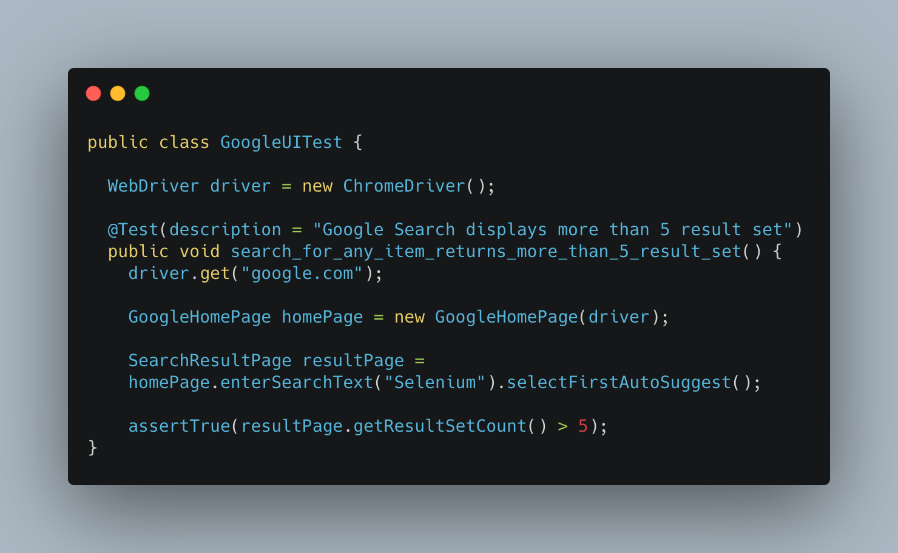
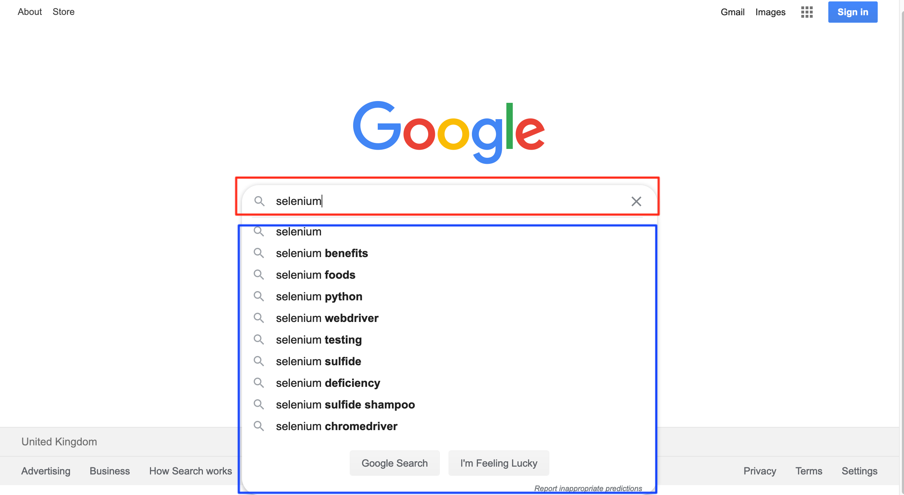
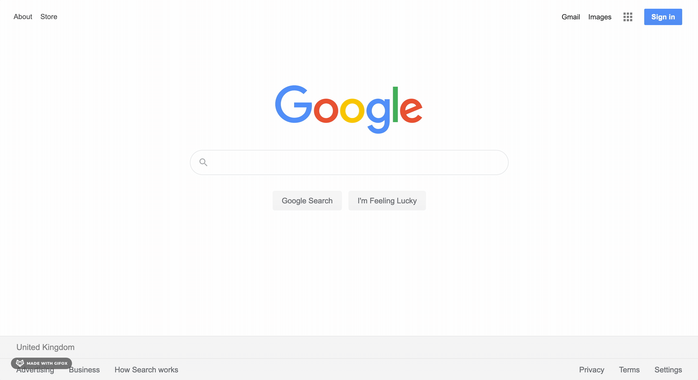
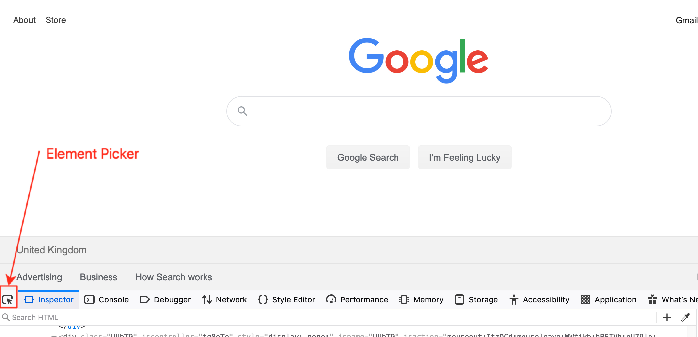
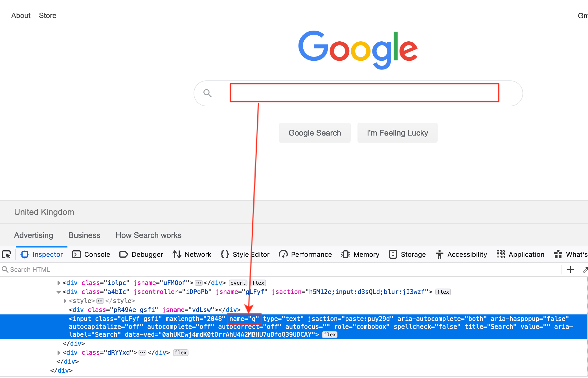
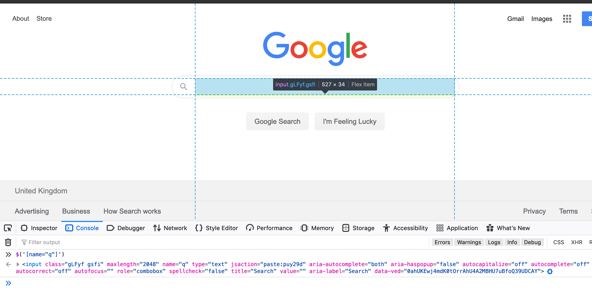
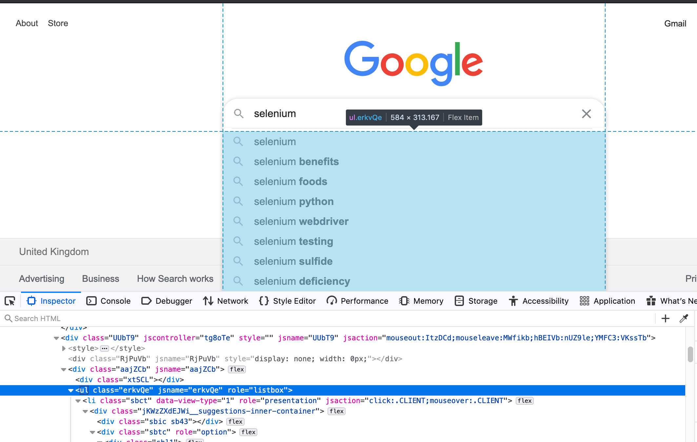
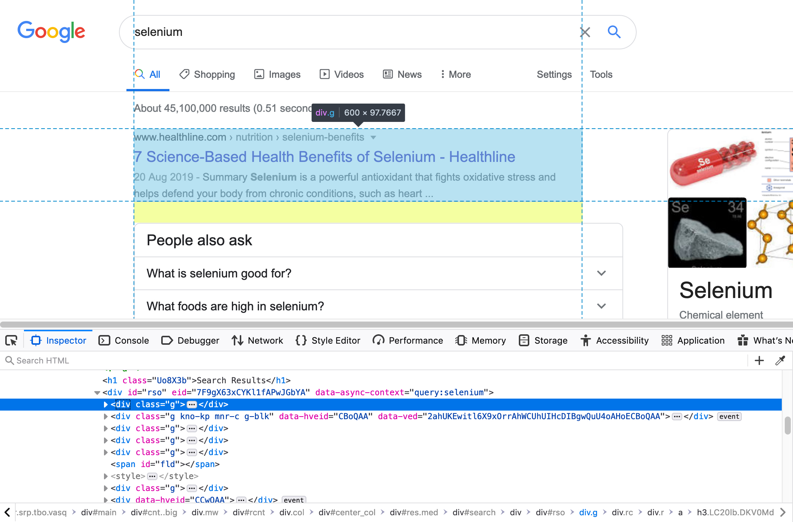
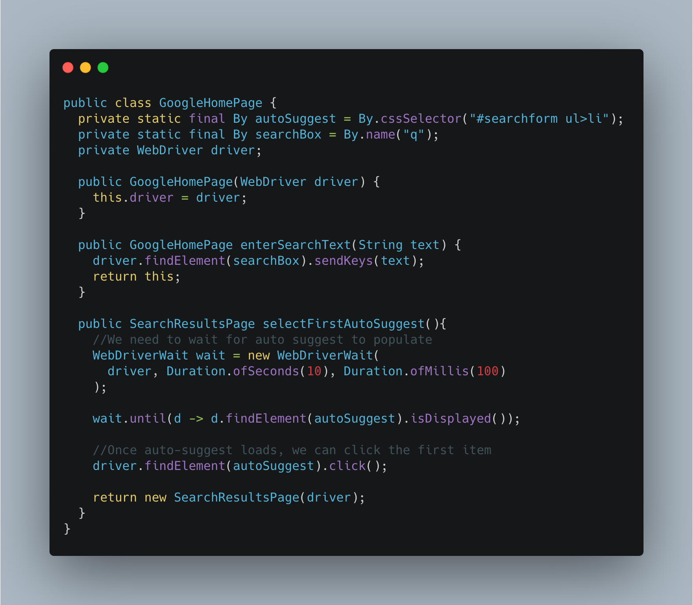
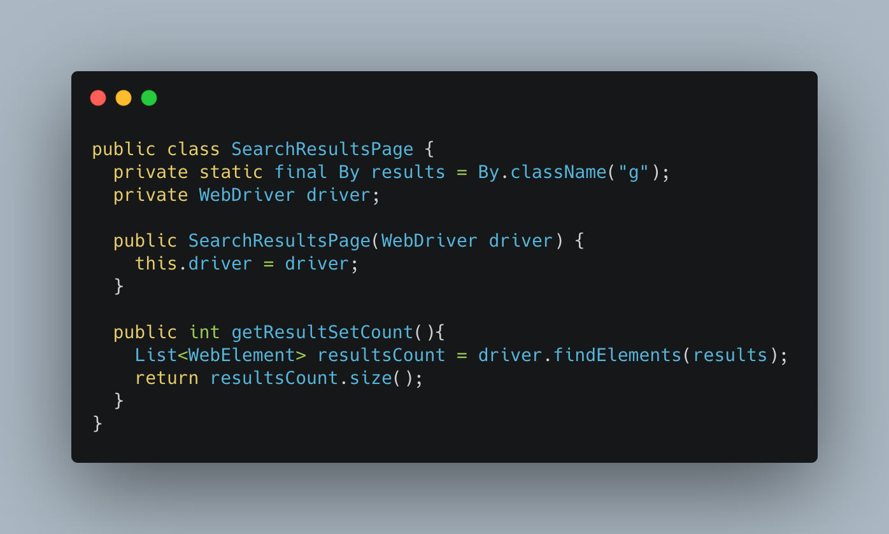

# A Beginner's Guide to Designing Page Objects - Pt.1

## Introduction
[Page Object](https://github.com/SeleniumHQ/selenium/wiki/PageObjects) is a popular design pattern used to represent services provided by a page (reads the rendered page you see on your screen)

<!--more-->

especially when writing test against a web page. This pattern is mainly popularised by the Selenium Browser Automation tool.

In this guide, we create a Page Object for the the Google `home and search results` page.

When you're finished, you'll be able to create effective page objects for any UI interface you encounter.

## Prerequisites

Before you begin this guide you'll need the following:

- An IDE (I use [IntelliJ Community Edition](https://www.jetbrains.com/idea/download/))
- [Maven](https://maven.apache.org/)
    - See [Installation help here](https://www.baeldung.com/install-maven-on-windows-linux-mac)
- A Selenium project that compiles (selenium version 4 and above)
- TestNG
- This example uses the Java binding.


- This guide will not cover locator strategies. It is well covered in the [selenium website documentation](https://www.selenium.dev/documentation/en/getting_started_with_webdriver/locating_elements/)


Let's do it :muscle:

## What are we testing?
We want to verify that the results page displays more than five links.

###  User journey
We need to figure out the user journey that makes up the test.

1. Goto `google.com`
1. Type `Selenium` in the searchbox
1. click the first suggestion from auto-suggest dropdown
1. Assert that more than 5 results sets are displayed on the search page.

Writing test first helps you get a clear picture of what Page Objects to build, and what apis the page object should expose.

Now we need to:

#### Identify the elements we need from the HomePage

From the picture above, there are multiple elements on the page, but we only need two of them

 - Searchbox
 - Auto-Suggest dropdown


- Don't make your page object a kitchen sink by selecting every possible object you see on the page.
Select only elements relevant for the user journey, anything more becomes [YAGNI](https://www.martinfowler.com/bliki/Yagni.html)


Now let's move to how we locate elements using the web console:

#### Locate desired elements on the page

There are several ways to locate the element we desire, e.g. by looking at the codebase, using selector tools etc.
Our focus for this guide is to use the browser debug console.

Let's go:
- Use Shortcut `CMD + ALT + i` to open the web console

We locate our first element - The `Searchbox`
- Select the element picker

- Point the element picker at the `Searchbox`, then click.

- Use the console to confirm if you got the right element node. if it works on the browser it will most likely work in Selenium.

Note down the selector `name=q`, because we need it to create our Page Object.

Next, we locate the second element - The `Auto-suggest` box
- Type any text on the searchbox and `Auto-suggest` box should appear
- Click on the element picker
- Point the element picker at the `Auto-suggest` box, then click.

Note down the selector `#searchform ul>li`, because we need it to create our Page Object.

Next, we locate the third element - The `The results element in the search result page`
- Type any text on the searchbox and `Auto-suggest` box should appear
- Click on the first suggestion, which should transition to `results page`
- Click on the element picker
- Point the element picker at the `result set` box, then click.

Note down the selector `class=g`, because we need it to create our Page Object.


- The following tutorials are great for beginner guide to DOM
  + [Introduction to DOM](https://www.digitalocean.com/community/tutorials/introduction-to-the-dom#the-document-object)
  + [DOM & Tree Nodes](https://www.digitalocean.com/community/tutorials/understanding-the-dom-tree-and-nodes)


Now that we have all the elements we need, Let's build the Page Object

## What have we done so far?
- We defined what we are testing
- Map out the user journey
- Found element locator values using the web console
- Confirmed we have the correct element using the console
- Created the page object with the correcet locators.

### See all classes here for easy reference.


- Don't copy and paste.
- Type the below code by hand.
- Read this brilliant [article](https://www.freecodecamp.org/news/the-benefits-of-typing-instead-of-copying-54ed734ad849/) to understand why.


## Conclusion

In this article you set up your first Page Object. Now you can run the test and put your result in the comments section.

## Things to Note
Read [next post](/posts/a-beginners-guide-to-designing-page-objects-pt.2) in the series
- Apply design techniques to optimise the Page Object design.

Before then, feel free to write another test and use completely different elements for the user journey.

I am happy to answer questions you may have, reach me on any of my handles.

