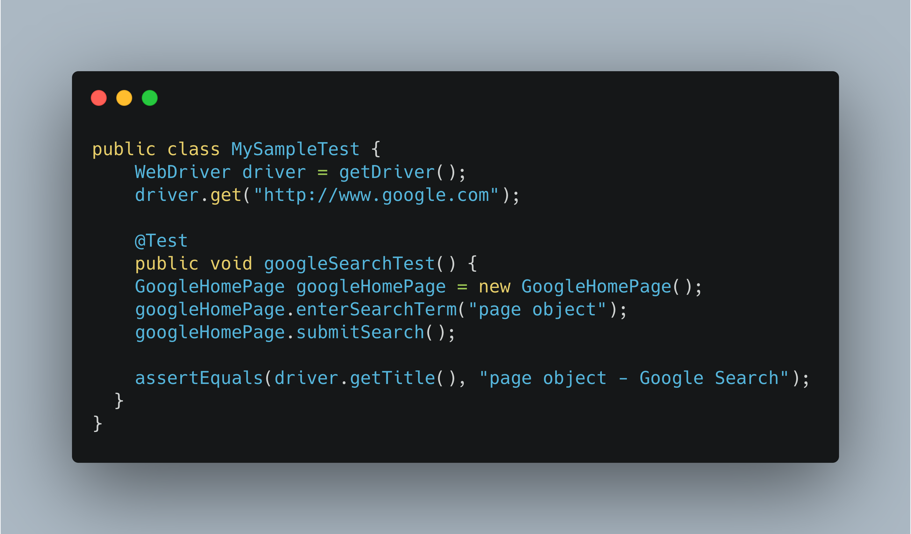
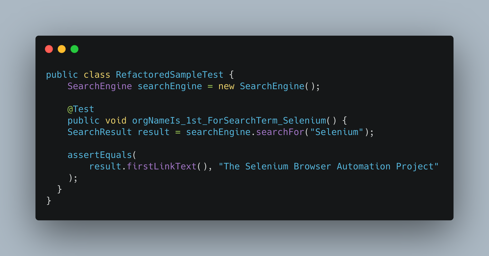

# Should I Remove PageObjects from my Test Class?


The short answer is YES!

<!--more-->


## Introduction
The [Page Object Pattern](https://github.com/SeleniumHQ/selenium/wiki/PageObjects) is a popular design pattern used to represent services provided by a page (reads the rendered page you see on your screen).
Whilst this is a good pattern to drive the application under test, it should not be visible to the test class.

## Why?
1. The test class is no longer isolated from internal code changes
2. Binds the test class to the underlying technology/library
3. Low-level code details pollute the test class

The test class should represent the domain behaviours only, not the implementation. There are benefits to doing this:

1. Your test is readable by engineers and non-technical colleagues
2. Your test is resistant to superficial changes. Only a change to the domain behaviour will cause your test class change.
3. Your test is technology agnostic, i.e. you are not bound to a particular technology.
4. It improves discoverability for users of your framework.

Let's examine an example:



*__Figure 1.1__*

From the above code, think about what happens in the following scenario:

a. The search engine changes from `Google` to `Bing`

b. If the method name changes from `submitSearch()` to `search()`

c. If the underlying library changes from `Selenium` to `HydrogenSulphur`?

Let's refactor the test class in *__Figure 1.1__* to focus on the domain behaviour removing the Page Object.

Assume the tests verifies:
```plain
The company name is the "first link text" in "Search Results"
when they "search for" "Selenium" on any "Search engine".
```
(Note: this is a trivia example, for illustration only)

Then:



*__Figure 1.2__*

As you can see there are no references to any page objects, instead domain
wrapper classes are used to represent the business language.

Let's revisit the earlier questions based on the refactored test.
```
-> The search engine changes from `Google` to `Bing`?
```
- `Test class is not aware of what engine is doing the search, so the test doesn't need to change`
```
-> If the method name changes from `submitSearch()` to `search()`?
```
- `The test only cares about the behaviour and results. Implementation is not the responsibility of the test`.
```
-> If the underlying library changes from `Selenium` to `HydrogenSulphur`?
```
- `The Test class is not bound to a specific library. In fact, you can use it as an API test without needing to change a single line`


## Conclusion
As with everything in life, context is key!

Understand and utilise what is best for your workflow or design decision(s).

However I'd recommend:

1. Don't let Page Objects bleed into your test.
2. Test classes should only focus on business scenarios.
3. Your test should focus on behaviour instead of implementation.



Now go give your Test Class some :heart:!

