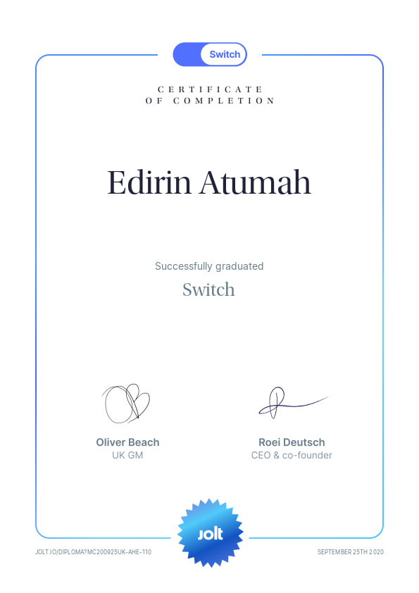
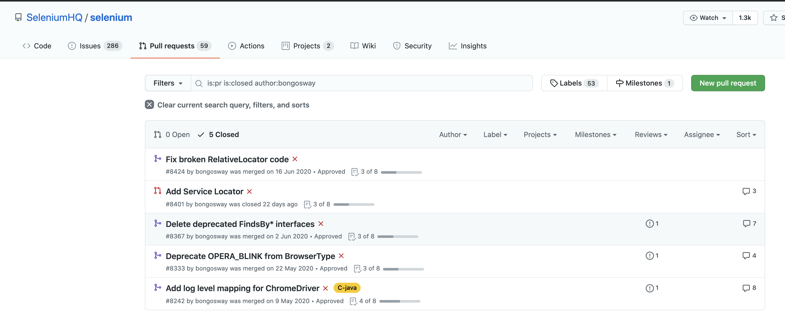

# My 2020 In Review: Staying Strong

## Introduction
Hey everyone! I’m excited to share with you my year end review for 2020.

<!--more-->

2020 has been about staying strong mentally! 😃

I’m glad to say that whilst 2020 might have been a tough year, I was able to achieve things I am proud of 💪.

I’m excited at what 2021 is going to bring.

Philippians 4:8:
-  In conclusion, my friends, fill your minds with those things that are good and that deserve praise: things that are true, noble, right, pure, lovely, and honourable.

## Personal Development
- **[Jolt Switch](https://london.jolt.io/switch-uk)** - August - September 2020

What an amazing course!

I enjoyed every bit of it, made new friends, improved the quality of my network and started on the path to becoming a CTO.

### Some feedback from my fellow soji's that made me happy

  _"Very cleaver, can solve every computer problem and clearly a deep thinker"_

  _"Thanks for sharing all your knowledge in class & on slack!"_

  _"Edi - I'll definitely miss, we've had a great time and a few laughs in the break out rooms."_

  

- Improved Communication
- Did a lot of DIY
- Joined CTO Community
- Mentored more Test Engineers, learnt alot about myself in the process

## Writing
- Started a Blog
- [Software Testing Weekly Magazine](https://softwaretestingweekly.com) and [Ministry of Testing](https://www.ministryoftesting.com/) featured my posts

_Was surprised to see my first attempt at blogging did good for the community._ 💪





## Speaking and Coaching
- Guest lecturer, teaching students introduction to Test automation.
- Conducted business seminar for a Charity in Colchester (before Covid-19 😉).
- Coached few testers into leadership roles.

## Open Source
- The Selenium core team accepted 4 of my Pull requests 🥳

- I got featured by Kong Inc for writing an Insomnia plugin to prevent storing password in plain text.



## 2021: What’s the Plan?
- Help more engineers become better communicators
- Continue on my CTO path
- Eat more healthy food
- Exercise more
- Take more technology leadership courses
- Start a foundation
- Revive the project - Empowering Children with Confidence, Communication and Computing Skills.

Thank you so much for sticking around. 🙇‍🙏

Look forward to connecting with and learning from you in this new year! 😃🙏👍🤗

Let's go 🏃‍♂️🏃‍♂️🏃‍♂️ 🚀 🚀 🚀

